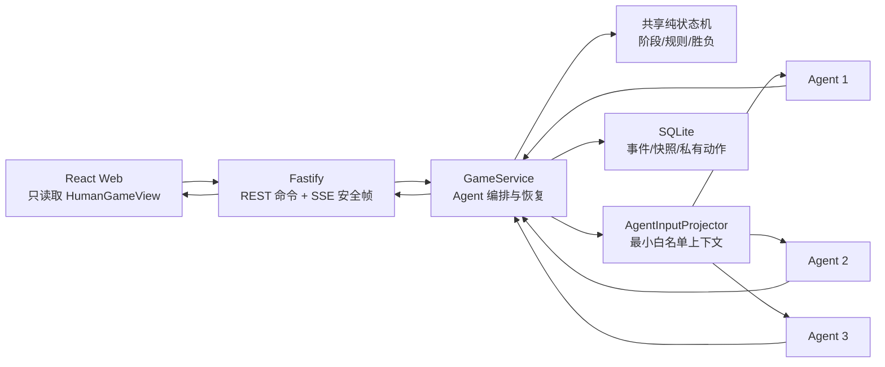

# 谁是卧底 · AI Multi-Agent 游戏

[GitHub 仓库](https://github.com/LBP97541135/sheishiwodi)

一个可以在本地完成整局的 AI 版“谁是卧底”：1 名人类玩家与 DeepSeek、豆包、千问 3 名 AI 玩家依次描述、秘密投票、平票辩解、重投和淘汰，终局后展示身份、词牌、信念轨迹、AI 评价并支持导出 Markdown。

项目的重点不是让多个模型自由聊天，而是用一个确定性的 Agent harness 管理它们：服务端状态机裁定阶段、合法目标和胜负；每个 Agent 只收到自己的词牌、自己的历史信念和已经公开的信息；模型只提出结构化行动，不能直接修改游戏状态。

## 快速开始

### 环境要求

- Node.js 22（仓库通过 [`.node-version`](.node-version) 固定为 22.14.0）。
- pnpm 9.15.9。

```bash
git clone https://github.com/LBP97541135/sheishiwodi.git
cd sheishiwodi
corepack enable
pnpm install
pnpm dev
```

浏览器访问 `http://127.0.0.1:9001`，Fastify API 监听 `http://127.0.0.1:3001`。默认使用 `FakeAgentPolicy`、本地词库和 SQLite，不需要 API Key、不会联网，也不会产生模型费用。

默认端口被占用时，可在本地环境中设置 `SHEISHIWODI_API_PORT`、`SHEISHIWODI_WEB_PORT` 和与前者一致的 `SHEISHIWODI_API_ORIGIN`；Playwright 可用独立的 `E2E_API_PORT`、`E2E_WEB_PORT` 与正在运行的开发服务并存。

首次运行 E2E 时，如本机还没有 Chromium：

```bash
pnpm exec playwright install chromium
```

### 启用真实模型

复制 [`.env.example`](.env.example) 为 `.env`，只在本机填写：

Tokendance 保持现有兼容配置和角色默认 model ID：

```dotenv
AGENT_PROVIDER=tokendance
TOKENDANCE_BASE_URL=https://your-openai-compatible-endpoint/v1
TOKENDANCE_API_KEY=your-local-secret
TOKENDANCE_REVIEW_MODEL=deepseek-v4-flash
```

重新运行 `pnpm dev`。三个参赛角色的 model ID 可以在“模型档案”中选择并持久化；复盘模型使用独立的 `TOKENDANCE_REVIEW_MODEL`。Base URL、API Key 和请求头只存在于服务端进程内，不进入浏览器、SQLite、日志、复盘或 Git。

接入其他 OpenAI Chat Completions 兼容中转站时使用独立配置：

```dotenv
AGENT_PROVIDER=openai-compatible
OPENAI_COMPATIBLE_BASE_URL=https://your-gateway.example/v1
OPENAI_COMPATIBLE_API_KEY=your-local-secret
OPENAI_COMPATIBLE_REVIEW_MODEL=your-review-model-id
OPENAI_COMPATIBLE_MODEL_EXTRA_BODY={"your-qwen-model-id":{"enable_thinking":false},"your-review-model-id":{"thinking":{"type":"disabled"}}}
```

通用模式**没有默认 model**：启动后进入“模型档案”，分别为 DeepSeek、豆包、千问手动填写并保存 model ID。中转站支持 `GET /models` 时输入框会提供候选；不支持时仍可直接填写。三个参赛 model 或 `OPENAI_COMPATIBLE_REVIEW_MODEL` 任一缺失，服务端都会在开始游戏前返回 `MODEL_CONFIGURATION_REQUIRED`，不会等到付费调用中途才失败。

通用协议没有统一的“关闭思考”字段，因此项目不会根据 model 名称自动猜测。需要加速时，用 `OPENAI_COMPATIBLE_MODEL_EXTRA_BODY` 按中转站的**精确 model ID**分别配置；三个参赛模型和评测模型共用该映射，未命中的模型不注入参数。`OPENAI_COMPATIBLE_EXTRA_BODY` 仍可设置所有模型共享的参数，model 专属映射覆盖同名顶层字段。完整注释和更多示例见 [`.env.example`](.env.example)。

如果 `AGENT_PROVIDER`、Base URL 或 API Key 任一缺失，运行时会明确保持假模型模式，不会半配置地调用外网。付费真实模型验收也必须通过下文的显式命令触发。

## 五分钟验收

1. 打开首页，点击标题中的“谁”配置玩家名称和形象，选择难度并进入经典模式。
2. 翻看自己的词牌并开始游戏；观察 3 个 AI 自动描述，人类回合到来时提交描述。
3. 进入秘密投票；投票完成前只能看到完成进度，全部完成后才统一揭票。
4. 继续到淘汰和终局，查看身份/词牌揭晓、事实时间线、AI 信念与复盘评价。
5. 导出当前对局 Markdown，检查其中没有密钥、接口地址或模型原始响应。

“猜词模式”是二期占位入口，当前只显示未开放提示，不会创建对局。

## 核心架构



- [`packages/shared`](packages/shared) 保存领域类型、Zod Schema、内容校验和纯状态机，不依赖 React、Fastify、数据库或网络。
- [`apps/server`](apps/server) 是唯一权威裁判。模型输出必须经过结构、信念、合法目标和内容校验，再转换成领域命令。
- [`apps/web`](apps/web) 只消费公开的 `HumanGameView` 和 SSE 安全帧，不读取数据库实体、完整快照或私有 Agent 动作。
- SQLite 在同一事务中提交新快照、不可变事件、私有 Agent 动作、公开安全帧和幂等命令结果。

## Multi-Agent 与 Harness

每个 AI 是独立策略实例，共享规则但不共享私有上下文。描述必须按公开顺序生成，因为前一人的描述会成为后一人的公开信息；同一投票阶段的 AI 选票互不可见、互不依赖，因此可以并行预取，再按状态机顺序校验和提交。

| Harness 层 | 解决的问题 | 实现方式 |
| --- | --- | --- |
| 输入投影 | 防止模型看到不该知道的信息 | `AgentInputProjector` 从权威快照构造不可变白名单，只含自己的词牌、公开事件、合法目标和自己的历史信念 |
| 结构合同 | 防止自然语言直接控制系统 | 描述、投票、信念和复盘都使用 strict Zod Schema；未知字段、漏字段、非法概率和非法目标会被拒绝 |
| 状态裁决 | 防止模型决定规则或胜负 | 模型只返回行动提案；共享纯状态机决定行动者、平票分支、淘汰和终局 |
| 自动恢复 | 降低真实模型的不稳定性 | 一次格式修复；内容错误重新生成；超时、网络、429、5xx 有限重试；永久配置错误不盲目重试 |
| 并发防护 | 防止慢请求覆盖新状态 | 每次调用绑定 `baseRevision`；返回后重新核对状态、行动者和动作类型，过期结果直接丢弃 |
| 幂等与恢复 | 防止刷新/重启产生重复行动 | 稳定 `commandId`、事务写入、活动局恢复、SSE 游标补发与客户端去重 |
| 可替换策略 | 兼顾可测性和真实体验 | 默认 `FakeAgentPolicy` 提供确定性测试；显式 provider 开关才实例化真实兼容协议策略 |
| 可观测性 | 证明调用链和信息边界 | 持久化脱敏 `model_attempts`，独立上下文清单记录来源、可见级别、游标、模板版本和 Prompt 哈希；出网前确定性拦截越权输入 |

真实 Provider 解析集中在 `provider-runtime.ts`：Tokendance 保持旧默认兼容，`openai-compatible` 只复用协议客户端和 harness，不注入厂商专用推理参数，也不继承任何模型 ID。

完整运行时契约见 [Agent 运行时规格](docs/spec/agent-runtime.md)。

本地调试时可在 `.env` 设置 `AGENT_DEVELOPER_MODE=true` 后重启服务。页面设置区会出现仅当前标签页生效的“开发者模式”开关，打开后可查看调用链、上下文清单、错误与恢复、复盘调度。完整 Prompt/原始响应使用面板内第二个默认关闭的敏感开关，只记录开启后的新调用、每条展开前再次确认，并过滤 Key、Base URL 和请求头；服务重启会自动关闭，记录最多保留 7 天且受 `AGENT_FULL_AUDIT_MAX_BYTES` 限制。总门禁关闭时诊断路由不注册，页面不会发出诊断请求。

## 信息隔离

隔离依赖服务端数据投影和字段不存在测试，不依赖提示词中的“请勿泄露”或前端 CSS 隐藏。

| 信息 | 对局中的当前 Agent | 浏览器 / REST / SSE | 终局复盘 |
| --- | --- | --- | --- |
| 自己的词牌 | 可见 | 仅人类自己的词牌可见 | 可见 |
| 其他玩家词牌、真实阵营 | 不可见 | 不存在 | 正常终局后可见 |
| 自己的历史信念 | 可见 | 不存在 | 可见 |
| 其他 Agent 信念和理由 | 不可见 | 不存在 | 正常终局后可见 |
| 当前阶段未揭晓选票 | 不可见 | 只公开完成进度 | 揭票事件后可见 |
| Base URL、API Key、请求头 | 不可见 | 不存在 | 永不进入复盘 |

淘汰后观战仍使用普通公开视图；主动放弃不会返回胜方、完整揭晓或私有行动复盘。只有正常 `finished` 视图包含 `reveal` 和 `factReview`。相关负向矩阵见 [测试与验收规格](docs/acceptance/TESTING.md)。

## 系统稳健性

- 可恢复错误与永久错误分开处理，避免认证失败或模型不存在时重复付费调用。
- 模型格式错误只允许一次结构修复；长度、句数等内容错误重新生成。
- 首次直接泄词会被秘密拦截；重复泄词会以不含原文的公开事件强制该玩家退出。
- 自动恢复耗尽后进入脱敏 `system_terminated`，不伪造阵营胜负，也不暴露上游响应。
- AI 调用期间发生放弃或其他状态变化时，旧 revision 的模型结果不会入库。
- 复盘异步生成、可持久化恢复和重新生成，不阻塞终局事实或开始新对局。

## AI 工具的使用与代码责任

这里区分两类 AI：

1. **产品内 AI**：DeepSeek、豆包、千问负责生成描述、信念和投票；独立复盘模型负责终局评价。它们都受相同的输入白名单、输出 Schema、状态机和错误恢复约束。
2. **开发辅助 Agent**：用于需求拆解、文档维护、代码实现、测试生成、浏览器检查和素材整理。负责人决定产品范围、架构边界、付费调用、Git 提交与发布，并对最终代码负责。

对 Agent 生成代码的验证不是“运行一次看起来能用”，而是：先登记 TASK 和验收点，再更新规格；把核心规则放入可独立测试的纯状态机；用 Schema 和负向断言验证边界；用假模型做确定性回归；最后才用显式真实模型命令验证结构、合法目标、耗时和隔离。关键取舍与修正记录在 [决策记录](docs/notes/DECISIONS.md)，每轮目标、变更、证据和未完成边界记录在 [开发记录](docs/history/PROJECT_LOG.md)。

## 测试与验证

```bash
pnpm test
pnpm typecheck
pnpm lint
pnpm build
pnpm test:e2e
```

默认测试和 E2E 强制假模型、临时 SQLite 和确定性随机序列，不读取 `.env` 中的 Key，也不访问网络。E2E 覆盖桌面与移动端的正常终局、刷新恢复、放弃、淘汰观战和平票重投。

GitHub Actions 使用同一 Node 22 与 pnpm 版本执行 typecheck、lint、默认测试、build 和 Playwright E2E。工作流显式强制假模型并清空真实 Provider 凭据，不调用任何 `test:live*`；真实模型验收始终由负责人在本地手动授权。

真实模型验证只能显式执行：

```bash
pnpm test:live:smoke   # 中转连通性与最小回复
pnpm test:live:policy  # 三个角色各执行真实 describe + vote
pnpm test:live:review  # 独立复盘模型的结构与隔离
pnpm test:live:full    # 可选，真实模型整局，调用和费用更多
```

通用中转站运行 `test:live:smoke` 时需显式设置 `OPENAI_COMPATIBLE_SMOKE_MODEL`；运行 `test:live:policy/full` 时还需设置 `OPENAI_COMPATIBLE_DEEPSEEK_MODEL`、`OPENAI_COMPATIBLE_DOUBAO_MODEL`、`OPENAI_COMPATIBLE_QWEN_MODEL`。这些仅用于独立验收，不会成为应用运行时默认 model。通用 smoke 不要求中转站实现 `GET /models`。

缺少真实模型配置时，上述命令会以非零退出码明确失败，不会静默回退假模型。可提交的脱敏结果、测试层级和当前环境边界见 [验收证据](docs/acceptance/EVIDENCE.md)。

## 已知问题与取舍

- 猜词模式尚未实现，目前只有明确的二期占位提示。
- 当前只提供本局复盘和 Markdown 导出，没有跨局历史列表。
- 真实模型已完成策略级、纯状态机整局，以及一次 Web/HTTP/SSE/SQLite 正常终局与真实复盘验收；该全栈验收是显式授权的一次性付费验证，不进入默认 CI 或长期 E2E。
- 角色 PNG 和 10.5 MB WAV 仍需在正式发布前压缩，并补齐最终素材来源记录。
- 模型输出具有随机性；默认自动化证明 harness 和规则稳定，不能保证每一次真实模型内容都同样精彩。

## 文档与迭代记录

- [文档导航](docs/README.md)：事实源优先级和阅读顺序。
- [产品需求](docs/acceptance/REQUIREMENTS.md)：当前范围与验收要求。
- [验收证据](docs/acceptance/EVIDENCE.md)：自动化、E2E、真实模型与浏览器验证摘要。
- [工程规格](docs/spec/README.md)：状态机、持久化、API、Agent 和前端契约。
- [任务台账](docs/tasks/TASKS.md) / [Checklist](docs/tasks/milestone-1-checklist.md)：任务状态和完成证据。
- [开发记录](docs/history/PROJECT_LOG.md)：按迭代记录目标、实现、验证和边界。
- [命令记录](docs/history/COMMAND_LOG.md) / [决策记录](docs/notes/DECISIONS.md)：需求演进和关键取舍。
- [版本记录](CHANGELOG.md)：较大版本变更。

历史记录用于解释“为什么这样做”，当前行为以 `docs/acceptance/` 和 `docs/spec/` 为准。
