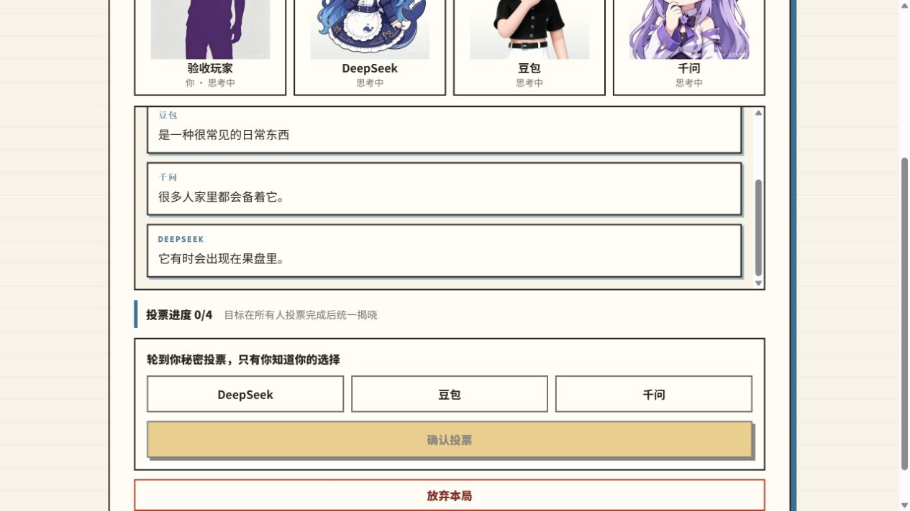
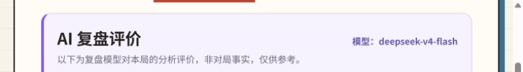

# 一次性全栈真实模型验收

本报告记录 2026-08-19 执行的 TASK-057 一次性付费验收。验收实际使用了本机 gitignored `.env` 中的真实 API Key；Key 仅注入临时服务端进程。本文及配套证据不包含 API Key、Base URL、请求头、完整模型响应、词牌或私有信念正文。

日期说明：2026-08-18 仅完成验收准备并在执行中阻塞，没有形成通过结论，也不计入本文结果。下列非付费门禁、真实对局、真实复盘、持久化恢复、导出和浏览器检查均在 2026-08-19 完成。

## 结论

**通过。** 一名人类与三名真实模型 Agent 经 Web、HTTP、SSE、服务端编排和 SQLite 完成唯一一局正常对局；终局状态为 `finished/ended`。独立真实复盘随后生成并持久化，Web 展示、浏览器刷新、服务端重启恢复和 Markdown 导出均通过。

## 环境与模型

| 项目 | 验收值 |
| --- | --- |
| 代码基线 | `master` / `f07a24a`，叠加本轮 TASK-071/072 验证修复 |
| 运行环境 | 临时 Node `v22.23.2`、独立 pnpm 依赖、临时 SQLite |
| Provider | `tokendance`，真实凭据已配置 |
| DeepSeek | `deepseek-v4-flash-0731` |
| 豆包 | `seed-2.1-turbo` |
| 千问 | `qwen3.7-plus` |
| 复盘模型 | `deepseek-v4-flash` |

三张参赛模型档案均由可见浏览器逐一保存到临时 SQLite；复盘模型由临时服务端进程显式设置。没有回退假模型或隐式切换 model。

## 非付费门禁

临时 Node 22 环境先执行全部默认门禁，默认测试与 E2E 均强制假模型、零真实调用：

| 门禁 | 结果 |
| --- | --- |
| Vitest | 186/186 通过（Shared 50、Server 83、Web 53） |
| Playwright E2E | 10/10 通过（normal 4、spectator 4、tie 2） |
| TypeScript | 通过 |
| ESLint | 通过 |
| 生产构建 | 通过 |

门禁发现并修复两个真实维护缺口：共享错误码遗漏导致模型配置门禁退化为通用 409，以及首页身份弹窗改版后 E2E 助手仍定位旧姓名输入框。二者均已补回归并通过全量门禁。

## 真实链路结果

| 指标 | 结果 |
| --- | --- |
| 正式对局数量 | 1 |
| 创建至正常终局 | 440 秒（7 分 20 秒） |
| 真实生成请求 | 37（含 smoke 与复盘） |
| 最终入库 AI 行动 | 26 |
| Harness 自动恢复额外请求 | 9（格式修复 4、内容重生成 5） |
| SQLite 领域事件 | 110 |
| SSE/公开流帧 | 91 |
| 已处理命令 | 38 |
| 复盘 | `done`，错误码为空 |
| Markdown 导出 | HTTP 200，`text/markdown; charset=utf-8`，具备下载头 |
| 浏览器控制台 | 0 warning / 0 error |

真实请求总数低于 40 次停止线；正式对局耗时低于 20 分钟停止线。过程中出现的模型结构或内容问题均由既有 harness 在预算内自动恢复，没有导致系统终止、伪造动作或人工重开。

## 持久化与隔离

- 正常终局后刷新浏览器，终局与真实复盘保持一致。
- 完整停止并重启 Server 后，再次刷新仍从同一临时 SQLite 恢复终局与 `deepseek-v4-flash` 复盘。
- 结构化只读摘要只查询状态、计数、model ID 和错误码，不读取或输出词牌、事件载荷、信念或模型正文。
- 临时数据库、依赖、运行时和下载文件不进入仓库；清理完成后不可恢复。

## 可见证据

进行中截图展示真实模型公开发言、秘密投票进度与四名玩家同步思考，不包含词牌：

复盘截图只保留真实 AI 复盘标题、评测 model ID 和非事实免责声明：

本次不新增长期真实模型 E2E 脚本。日常回归继续使用确定性假模型；真实付费验收只在负责人显式授权、配置本地凭据并接受费用后执行。
