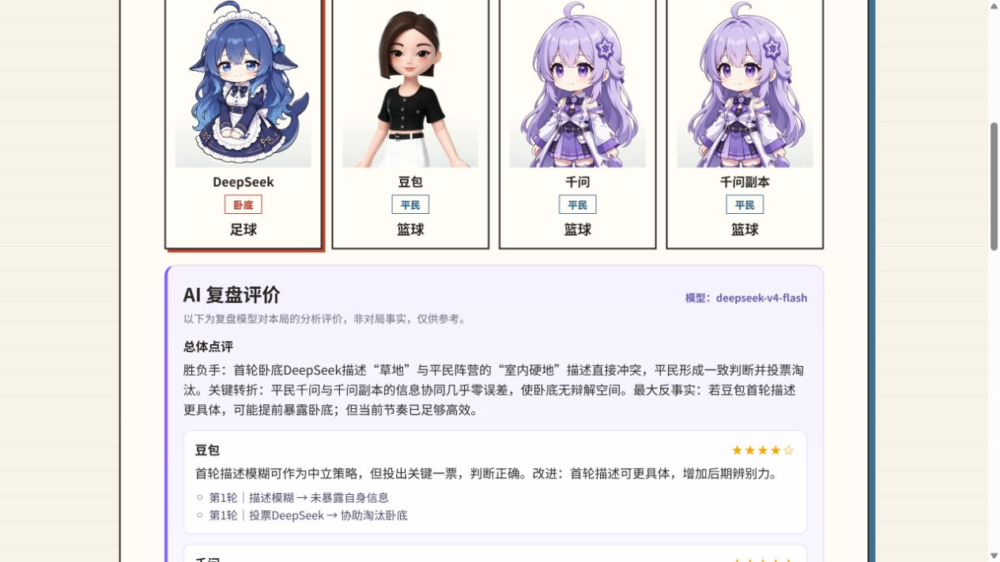

# 扩展玩法后的全栈真实模型回归

本报告记录 2026-08-20 对最新扩展版本执行的一次付费回归。验收明确使用本机 gitignored `.env` 中的真实 API Key；Key 只注入临时 Node 22 服务端。本文和截图不包含 API Key、Base URL、请求头、完整模型响应或私有信念正文。

## 结论

**通过。** 玩家占用 DeepSeek 角色后，与豆包、千问和一个千问自建副本经 Web、HTTP/SSE、服务端 Agent 编排和临时 SQLite 完成唯一一局经典模式。三个真实 Agent 完成描述和秘密投票，平民阵营在首轮淘汰卧底并正常终局；异步真实复盘、浏览器刷新恢复、开发者观测和 Markdown 导出均通过。

付费前的浏览器检查发现角色库往返会卸载新局表单并丢失夺舍身份和阵容草稿。TASK-091 已先修复并补测试，随后重启同一临时环境再开始唯一一局付费对局；缺陷复现和修复阶段没有发起模型调用。

## 环境与阵容

| 项目 | 验收值 |
| --- | --- |
| 代码基线 | `codex/agent-engineering-hardening`，含 `321736d` |
| 运行环境 | Docker Node `v22.23.2`、临时 SQLite、独立端口 |
| Provider | `tokendance`，真实凭据已配置 |
| 人类席位 | 占用 DeepSeek 名称与素材，不调用 DeepSeek 模型 |
| Agent 席位 | 豆包、千问、千问自建副本 |
| 复盘模型 | `deepseek-v4-flash` |

千问副本通过真实角色库“复制”操作创建，继承千问模型绑定和六态素材，同时保持独立自建角色身份。玩家占用 DeepSeek 后，该角色从 AI 阵容排除；人类描述与投票均由浏览器实际提交。

## 零付费门禁

| 门禁 | 结果 |
| --- | --- |
| Vitest | 260/260（Shared 68、Server 121、Web 71） |
| TypeScript | 三个 workspace 通过 |
| ESLint | 全仓通过 |
| 生产构建 | Shared、Server、Web 通过 |
| TASK-091 定向回归 | Web 13/13，通过角色库往返仍保留 DeepSeek 夺舍 |

上述门禁强制使用 fake/scripted 模型，不产生额外真实调用。旧验证镜像没有挂载最新 `packages/shared/test`，因此 Shared 测试和类型检查另用一次性 Node 22 容器挂载当前目录复核，未把旧镜像结果冒充为当前结果。

## 真实链路结果

| 指标 | 结果 |
| --- | --- |
| 正式付费对局 | 1 局 |
| 终局 | `finished/ended`，平民胜利，首轮淘汰卧底 |
| AI 私有行动 | 6（3 次描述、3 次投票） |
| 模型尝试 | 8（6 个对局成功行动、1 次格式修复、1 次复盘） |
| 公开时间线 | 21 条 |
| 系统终止 / 待确认中断 | 0 / 0 |
| Provider 熔断 | `closed` |
| 复盘调度 | 已完成，执行中为空、等待队列为空 |
| Markdown 导出 | HTTP 200，7137 bytes |

千问副本第一次投票返回的信念不变量不合法。Harness 将该尝试脱敏记录为 `invalid_format:belief_invalid`，没有提交非法动作；唯一一次定向格式修复随后通过 `schema_validated -> content_validated -> action_committed`。其余真实行动均一次成功，没有无限重试、内容泄词、系统终止或人工重开。

## 信息边界与恢复

- 七个对局/复盘逻辑调用的上下文清单全部为 `passed`；参赛 Agent 只取得公开配置、公开阵容、自有词牌、自有身份、截至对应游标的公开事件、自有历史信念和当前合法动作约束。
- 三名 Agent 的投票输入共享投票前公开游标，不包含其他尚未揭晓的投票目标；页面仅显示完成进度，最后统一揭票。
- 终局前页面没有显示阵营、其他词牌或私有信念；终局后才出现完整身份和词牌。
- 浏览器刷新后恢复相同终局。自建角色在初始权威视图到达后的短暂占位状态显示“身份揭晓中…”，随后自动恢复完整身份和词牌；真实复盘保持可访问。
- 开发者模式默认关闭。显式开启后可读取脱敏调用阶段、上下文来源、一次失败与恢复结果和复盘队列；完整 Prompt/响应记录保持关闭。

## 可见证据

下图为真实终局刷新恢复后的复盘页面，包含四个角色的终局身份、评测模型标识和 AI 评价，不包含 Provider 配置或凭据：

本次仍不把付费浏览器流程加入默认 CI。日常回归继续使用确定性假模型；真实 API 验收只在负责人显式授权并接受费用后执行。
